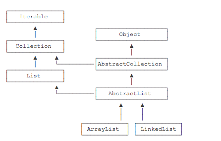

### 抽象类
	1. 如果父类的方法本身不需要实现任何功能，仅仅是为了定义方法签名，目的是让子类去覆写它，那么，可以把父类的方法声明为抽象方法：
		class Person {
			public abstract void run();
		}

	2. 把一个方法声明为abstract，表示它是一个抽象方法，本身没有实现任何方法语句。因为这个抽象方法本身是无法执行的，所以，Person类也无法被实例化。编译器会告诉我们，无法编译Person类，因为它包含抽象方法。必须把Person类本身也声明为abstract，才能正确编译它：
		abstract class Person {
			public abstract void run();
		}

	3. 因为抽象类本身被设计成只能用于被继承，因此，抽象类可以强迫子类实现其定义的抽象方法，否则编译会报错。因此，抽象方法实际上相当于定义了“规范”。

	4. 例如，Person类定义了抽象方法run()，那么，在实现子类Student的时候，就必须覆写run()方法：
		abstract class Person {
			public abstract void run();
		}

		class Student extends Person {
			@Override
			public void run() {
				System.out.println("Student.run");
			}
		}

### 面向抽象编程
	1. 当我们定义了抽象类Person，以及具体的Student、Teacher子类的时候，我们可以通过抽象类Person类型去引用具体的子类的实例：
		Person s = new Student();
		Person t = new Teacher();

	2. 这种引用抽象类的好处在于，我们对其进行方法调用，并不关心Person类型变量的具体子类型：
		// 不关心Person变量的具体子类型:
		s.run();
		t.run();

	3. 同样的代码，如果引用的是一个新的子类，我们仍然不关心具体类型：
		// 同样不关心新的子类是如何实现run()方法的：
		Person e = new Employee();
		e.run();

	4. 这种尽量引用高层类型，避免引用实际子类型的方式，称之为面向抽象编程；

	5. 面向抽象编程的本质就是：
		* 上层代码只定义规范（例如：abstract class Person）；
		* 不需要子类就可以实现业务逻辑（正常编译）；
		* 具体的业务逻辑由不同的子类实现，调用者并不关心。

### 抽象类小结
	1. 通过abstract定义的方法是抽象方法，它只有定义，没有实现。抽象方法定义了子类必须实现的接口规范；

	2. 定义了抽象方法的class必须被定义为抽象类，从抽象类继承的子类必须实现抽象方法；

	3. 如果不实现抽象方法，则该子类仍是一个抽象类；

	4. 面向抽象编程使得调用者只关心抽象方法的定义，不关心子类的具体实现。

### 接口
	1. 在抽象类中，抽象方法本质上是定义接口规范：即规定高层类的接口，从而保证所有子类都有相同的接口实现，这样，多态就能发挥出威力。
		a. 如果一个抽象类没有字段，所有方法全部都是抽象方法：
			abstract class Person {
				public abstract void run();
				public abstract String getName();
			}
		b. 就可以把该抽象类改写为接口：interface:
			interface Person {
				void run();
				String getName();
			}

	2. 所谓interface，就是比抽象类还要抽象的纯抽象接口，因为它连字段都不能有。因为接口定义的所有方法默认都是public abstract的，所以这两个修饰符不需要写出来;

	3. 当一个具体的class去实现一个interface时，需要使用implements关键字:
		class Student implements Person {
			private String name;

			public Student(String name) {
				this.name = name;
			}

			@Override
			public void run() {
				System.out.println(this.name + " run");
			}

			@Override
			public String getName() {
				return this.name;
			}
		}

	4. 在Java中，一个类只能继承自另一个类，不能从多个类继承。但是，一个类可以实现多个interface；

### 区分术语
	1. Java的接口特指interface的定义，表示一个接口类型和一组方法签名，而编程接口泛指接口规范，如方法签名，数据格式，网络协议等。

	2. 抽象类和接口的对比如下：
		|   | abstract class | interface  |
		| 继承 | 只能extends一个class  |  可以implements多个interface |
		| 字段 | 可以定义实例字段  |  不能定义实例字段 |
		| 抽象方法 | 可以定义抽象方法  | 可以定义抽象方法  |
		| 非抽象方法 | 可以定义非抽象方法  | 可以定义default方法  |

### 接口继承
	1. 一个interface可以继承自另一个interface。interface继承自interface使用extends，它相当于扩展了接口的方法：
		interface Hello {
			void hello();
		}

		interface Person extends Hello {
			void run();
			String getName();
		}

### 继承关系
	1. 合理设计interface和abstract class的继承关系，可以充分复用代码。一般来说，公共逻辑适合放在abstract class中，具体逻辑放到各个子类，而接口层次代表抽象程度。可以参考Java的集合类定义的一组接口、抽象类以及具体子类的继承关系：
		

	2. 在使用的时候，实例化的对象永远只能是某个具体的子类，但总是通过接口去引用它，因为接口比抽象类更抽象：
		List list = new ArrayList(); // 用List接口引用具体子类的实例
		Collection coll = list; // 向上转型为Collection接口
		Iterable it = coll; // 向上转型为Iterable接口

### default方法
	1. 在接口中，可以定义default方法。例如，把Person接口的run()方法改为default方法：
		public class Main {
			public static void main(String[] args) {
				Person p = new Student("Xiao Ming");
				p.run();
			}
		}

		interface Person {
			String getName();
			default void run() {
				System.out.println(getName() + " run");
			}
		}

		class Student implements Person {
			private String name;

			public Student(String name) {
				this.name = name;
			}

			public String getName() {
				return this.name;
			}
		}

	2. 实现类可以不必覆写default方法。default方法的目的是，当我们需要给接口新增一个方法时，会涉及到修改全部子类。如果新增的是default方法，那么子类就不必全部修改，只需要在需要覆写的地方去覆写新增方法。

	3. default方法和抽象类的普通方法是有所不同的。因为interface没有字段，default方法无法访问字段，而抽象类的普通方法可以访问实例字段。

### 接口小结
	1. Java的接口（interface）定义了纯抽象规范，一个类可以实现多个接口；

	2. 接口也是数据类型，适用于向上转型和向下转型；

	3. 接口的所有方法都是抽象方法，接口不能定义实例字段；

	4. 接口可以定义default方法（JDK>=1.8）；

